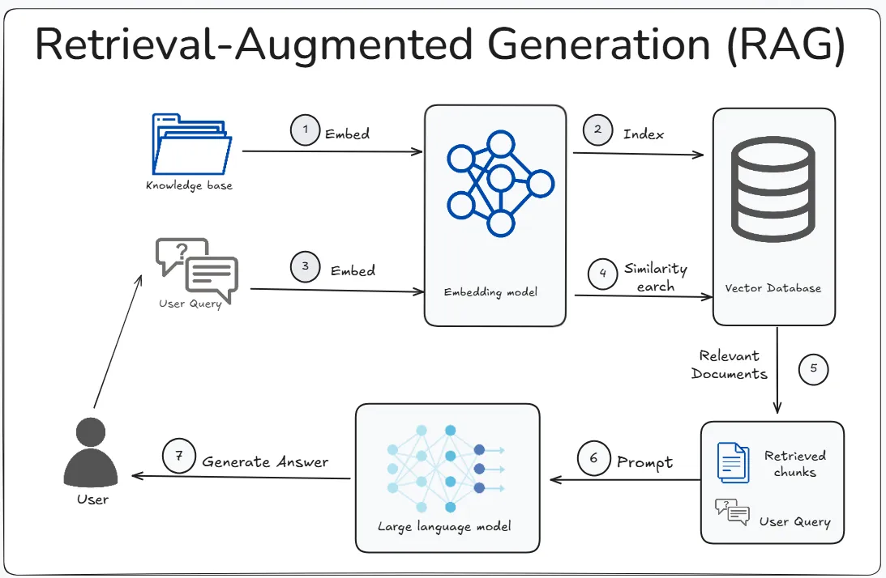

# 🔍 RAG Knowledge Query System

A beginner-friendly Retrieval-Augmented Generation (RAG) application built with Streamlit that helps understand how RAG works by allowing you to upload PDF documents, explore how they are represented for the models and ask questions about them.


## 🚀 Quick Start with Docker

### Prerequisites
- Docker and Docker Compose installed on your system
- A Google Gemini API key (get one from [Google AI Studio](https://makersuite.google.com/app/apikey))

### Deploy and Run
```bash
# Clone the repository
git clone git@github.com:arturokkboss33/introductory-gen-agentic-ai-tutorials.git
cd introductory-gen-agentic-ai-tutorials/rag-basic

# Build and run with Docker Compose
docker-compose up --build

# Access the application
# Open your browser and go to: http://localhost:8501
```

The application will be available at `http://localhost:8501`. Enter your Gemini API key in the sidebar to get started!
If you wish to change the port number, modify the `Dockerfile` and `docker-compose.yaml` accordinlgy.

## 📖 Understanding RAG: How This App Works

### What is RAG?
Retrieval-Augmented Generation (RAG) combines the functionalities of information retrieval with language generation. Instead of relying solely on the AI model's training data, RAG first retrieves relevant information from your specific documents, then uses that context to generate accurate, grounded answers.

### Understanding the RAG Pipeline
1. **Documents** → **Chunks** → **Embeddings** → **Vector Database**
2. **User Question** → **Query Embedding** → **Similarity Search** → **Retrieved Context**
3. **Context + Question** → **Language Model** → **Generated Answer**

### Important Parameters to Experiment With

- **Chunk Size**: Larger chunks provide more context but may be less precise
- **Chunk Overlap**: Prevents important information from being split across chunks
- **Temperature**: Controls how creative vs. factual the responses are
- **Retrieval Count**: Number of relevant chunks to include (fixed at 5 in this app)

### Visualization Insights
- **Clusters**: Groups of similar content (udnerlying themes or topics)
- **Distance**: Semantic similarity between documents

### 🧪 Experiment and Learn

Try different combinations of:
- Various chunk sizes (small: 100, medium: 200, large: 500)
- Different overlap ratios (0%, 25%, 50%)
- Temperature settings for different question types
- Custom prompts for domain-specific responses

The visualization tab helps you understand how these parameters affect document representation and retrieval quality.


## 🔧 Core Functionality

### 1. Document Processing & Embedding Creation

**Purpose**: Transform your PDF documents into searchable vector representations that the AI can understand and retrieve from.

**Key Files**: `dbchunks.py`, `utils.py`

**Step-by-Step Process**:



1. **Document Loading** (`chunkize_and_add_to_db()`)
   - Loads PDF files using Langchain's `PyPDFLoader`
      ```
      # See dbchunks.py
      loader = PyPDFLoader(tmp_file_path)
      data = loader.load()  # Returns list of Document objects
      ```
   - Extracts text content from each page
      ```
      # See dbchunks.py
      doc_metadata = [data[i].metadata for i in range(len(data))]
      doc_content = [data[i].page_content for i in range(len(data))]
      ```   
2. **Text Chunking** 
   - Splits documents into smaller, manageable pieces (chunks) using `SentenceTransformersTokenTextSplitter`
   - **Key Parameters** (exposed in GUI):
     - **Chunk Size**: Number of tokens per chunk (50-1000, default: 200)
     - **Chunk Overlap**: Overlapping tokens between chunks (default: 50)
   - Why chunking matters? Large documents must be broken down for precise retrieval and to fit within AI model context limits

3. **Embedding Generation**
   - Converts each text chunk into a high-dimensional vector using Google's `embedding-001` model
   - These vectors capture semantic meaning - similar chunks have similar vectors
      ```
      # Initiliazation of Google's embedding model in utils.py
      st.session_state.embedding_model = GoogleGenerativeAIEmbeddings(
         model="models/embedding-001",  # Google's embedding model
         google_api_key=st.session_state.get("gemini_api_key")
      )
      # Embedding generation for a chunk, see dbchunks.py
      embedding = st.session_state.embedding_model.embed_query(chunk.page_content)
      ```

4. **Vector Storage**
   - Stores embeddings in a Chroma vector database
   - Enables fast similarity search during retrieval
      ```
      # Initialization of vector DB based on embedding model, see utilis.py 
      st.session_state.db = Chroma(
            collection_name=collection_name,
            embedding_function=st.session_state.embedding_model,
            persist_directory=db_dir
      )

      # Automatically generates an embedding from a chunk and stores them in DB
      st.session_state.db.add_documents(st_chunks)
      ```

### 2. RAG Query Processing

**Purpose**: Answer user questions by finding relevant document chunks and generating contextual responses.


**Key Files**: `ragchain.py`, `utils.py`

**Step-by-Step Process** (`run_rag_chain()`):

1. **Query Processing**
   - Takes user's natural language question
   - Converts question to vector representation *Note: this conversion happens when rag_chain is invoke*
      ```
      # Create the prompt template object, in ragchain.py
      prompt_template = ChatPromptTemplate.from_template(PROMPT_TEMPLATE)
      ```

2. **Retrieval** 
   - Performs similarity search in vector database
   - Retrieves most relevant document chunks
   - Uses cosine similarity to find semantically related content
      ```
      # Retriever object that defines the type of symilarity search to retrieve relevant documents
      # See ragchain.py
      retriever = st.session_state.db.as_retriever(
         search_type="similarity",     # Use cosine similarity between embeddings
         search_kwargs={'k': 5}        # Retrieve top 5 most similar chunks
      )
      ```

3. **Context Preparation**
   - Combines retrieved chunks into a single context string (`format_docs()`)
   - Within rag_chain definition, when the chain runs this `retriever | format_docs`:
      - Takes the user's query
      - Converts it to an embedding
      - Searches the vector database for the 5 most similar chunks
      - Formats the retrieved documents into a single context string
   
4. **Prompt Construction**
   - Inserts retrieved context and user question into a prompt template
   - **Key Parameter** (exposed in GUI):
     - **Custom Prompt Template**: Allows users to modify how the AI responds
     - Must include `{context}` and `{question}` placeholders
      ```
      # Create the prompt template object, see ragchain.py
      prompt_template = ChatPromptTemplate.from_template(PROMPT_TEMPLATE)
      ```
5. **Response Generation**
   - Sends prompt to Google's Gemini model
   - **Key Parameter** (exposed in GUI):
     - **Temperature** (0.0-2.0): Controls response creativity
       - 0.0 = Deterministic, factual
       - 1.0 = Balanced (default)
       - 2.0 = Highly creative
      ```
      # Initiliazation of LLM model to used for querying. see ragchain.py
      chat_model = ChatGoogleGenerativeAI(
        model="gemini-2.5-flash",                              
        api_key=st.session_state.get("gemini_api_key"),
        temperature=temperature                                # User-controlled randomness parameter
      )
      ```

6. **Output Parsing**
   - Extracts and returns the final text response
      ```
      # Definition of Parser used to extract the text from the model response
      # From the Langchain libraries. See ragchain.py
      output_parser = StrOutputParser()

      # This creates a pipeline: retrieve → format → prompt → generate → parse
      rag_chain = (
         {
               "context": retriever | format_docs,    # Retrieve docs and format as single string
               "question": RunnablePassthrough()      # Pass the question through unchanged
         } 
         | prompt_template                          # Insert context and question into prompt
         | chat_model                               # Generate response using language model
         | output_parser                            # Extract text from model response
      )

      # Step 9: Execute the RAG chain with the user's query
      try:
         response = rag_chain.invoke(query)
      ```

### 3. Embedding Visualization

**Purpose**: Help users understand how their documents relate to each other in high-dimensional space.

**Key Files**: `plotembeddings.py`

**Step-by-Step Process** (`create_embedding_visualization()`):

1. **Data Preparation**
   - Subsamples chunks for manageable visualization, i.e., prevent cluttering of plots (`subsample_chunks_per_document()`)
   - **Key Parameter** (exposed in GUI):
     - **Max Chunks per Document**: Controls visualization complexity (10-200, default: 50)

2. **Dimensionality Reduction**
   - Reduces high-dimensional embeddings to 2D or 3D for visualization
   - **Key Parameters** (exposed in GUI):
     - **Algorithm**: UMAP (faster, global structure) or t-SNE (detailed clusters)
     - **Dimensions**: 2D (easier interpretation) or 3D (detailed exploration)
      ```
      # From the UMAP and TSNE standard librries
      # See plotembeddings.py
      if visualization_type == 'UMAP':
         # UMAP parameters optimized for document embeddings
         n_neighbors = min(15, len(embeddings) - 1)
         if n_neighbors < 2:
            n_neighbors = 2
         reducer = UMAP(
            n_components=n_components, 
            random_state=42,
            n_neighbors=n_neighbors,
            min_dist=0.1,
            metric='cosine'  # Good for text embeddings
         )
         reduced_embeddings = reducer.fit_transform(embeddings)
      else:  # t-SNE
         # t-SNE parameters optimized for text data
         perplexity = min(30, max(5, len(embeddings) - 1))
         if perplexity < 1:
            perplexity = 1
         reducer = TSNE(
            n_components=n_components, 
            random_state=42, 
            perplexity=perplexity,
            max_iter=1000,
            learning_rate='auto'
         )
         reduced_embeddings = reducer.fit_transform(embeddings)
     ```

3. **Interactive Plotting**
   - Creates interactive Plotly visualizations
   - Colors represent different documents
   - Hover shows chunk content
   - Proximity indicates semantic similarity

## 📁 File Structure & Purpose

### Core Application Files

- **`app.py`**: Main Streamlit interface
  - Orchestrates all components
  - Handles user interactions and GUI layout
  - Manages application state and navigation

- **`ragchain.py`**: RAG processing engine
  - Implements the core RAG pipeline
  - Manages language model interactions
  - Handles prompt engineering and response generation

- **`dbchunks.py`**: Document processing pipeline
  - PDF loading and text extraction
  - Text chunking and preprocessing
  - Embedding generation and database storage

- **`plotembeddings.py`**: Visualization engine
  - Dimensionality reduction algorithms (UMAP/t-SNE)
  - Interactive plot generation
  - Data subsampling for performance

- **`utils.py`**: System utilities
  - Model initialization and caching
  - Database management and cleanup
  - Configuration and parameter handling